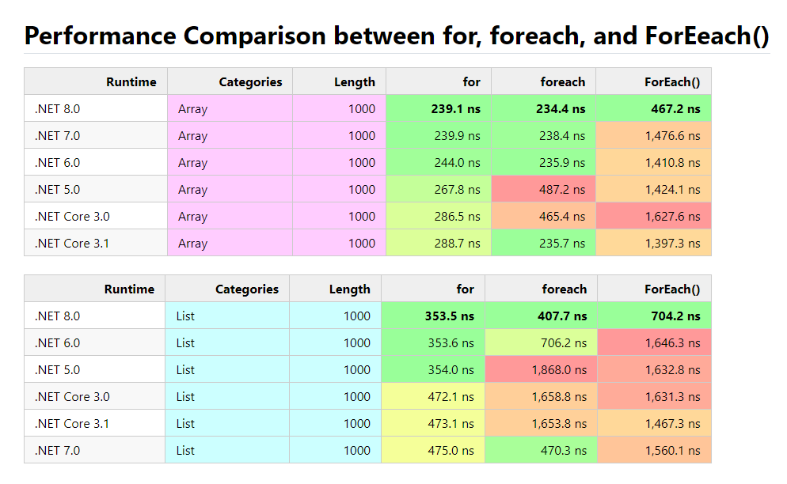
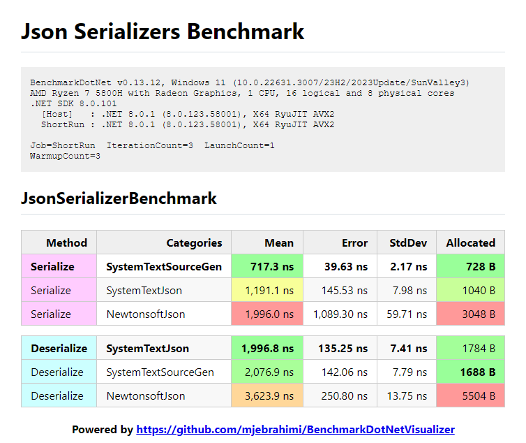
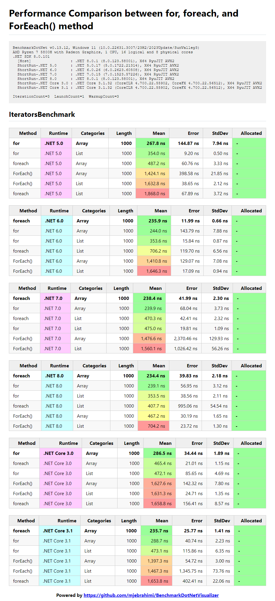
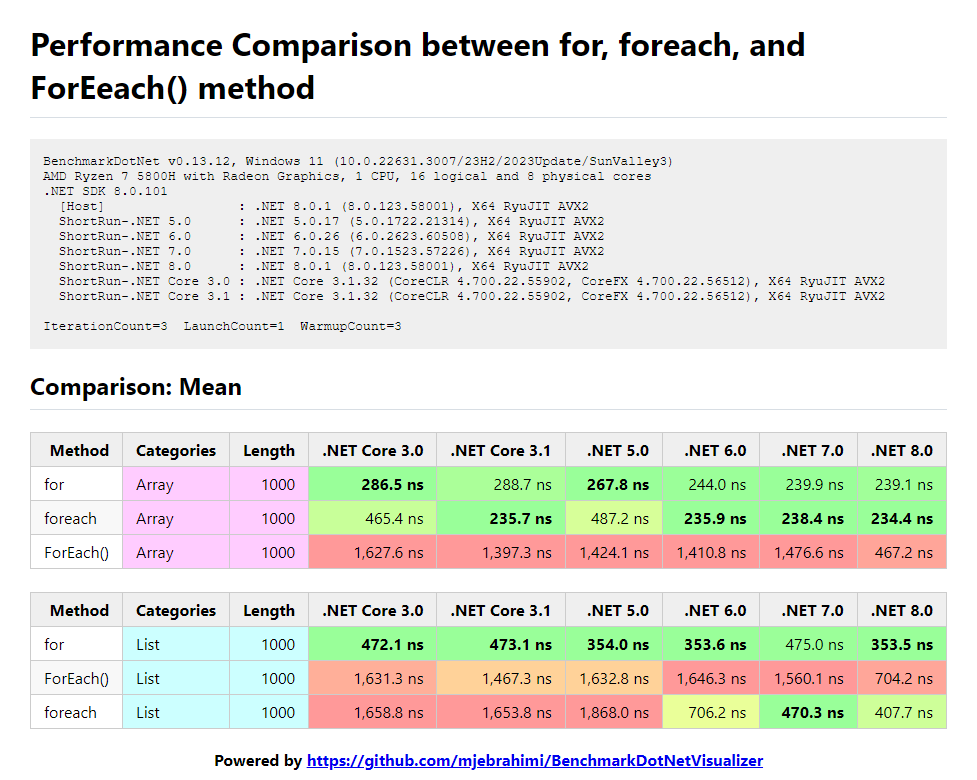
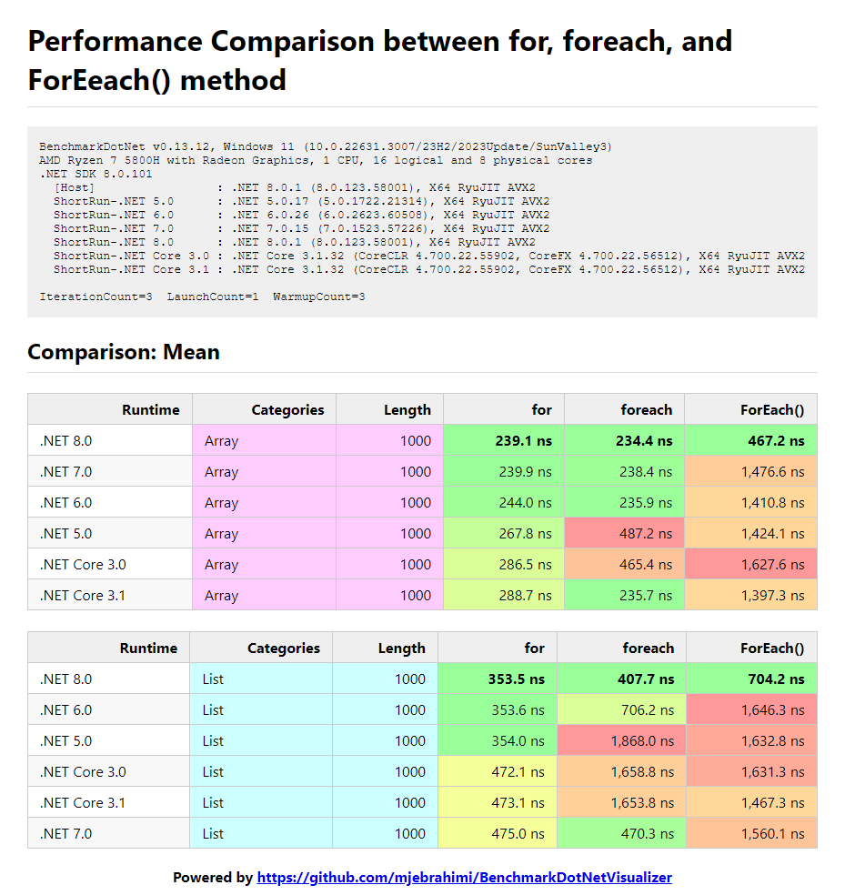

# BenchmarkDotNetVisualizer

Visualizes your BenchmarkDotNet benchmarks to colorful images, feature-rich HTML, and customizable markdown files (and maybe powerful charts in the future!)

**You can create something like this:**



## Table of Content

- [A Real World Demo (DotNet Collections Benchmark)](#a-real-world-demo-dotnet-collections-benchmark)
- [Getting Started](#getting-started)
- [1. Install Package](#1-install-package)
- [2. Using Exporters](#2-using-exporters)
  - [Example 1 (Json Serializers Benchmark)](#example-1-json-serializers-benchmark)
- [3. Using Extensions methods on benchmark's Summary (SaveAsHtmlAndImageAsync and etc...)](#3-using-extensions-methods-on-benchmarks-summary-saveashtmlandimageasync-and-etc)
  - [Example 2 (Iterators for/foreach/ForEach() Benchmark)](#example-2-iterators-forforeachforeach-benchmark)
- [4. Using JoinReports method to Join and Pivot reports (JoinReportsAndSaveAsHtmlAndImageAsync, and etc...)](#4-using-joinreports-method-to-join-and-pivot-reports-joinreportsandsaveashtmlandimageasync-and-etc)
  - [Example 3 (Performance comparison between for, foreach, and ForEach() method among different versions of .NET)](#example-3-performance-comparison-between-for-foreach-and-foreach-method-among-different-versions-of-net)
  - [Example 4 (Performance comparison between for, foreach, and ForEach() method among different versions of .NET)](#example-4-performance-comparison-between-for-foreach-and-foreach-method-among-different-versions-of-net)
- [Contributing](#contributing)
- [Give a Star! ⭐️](#give-a-star-️)
- [License](#license)

## A Real World Demo (DotNet Collections Benchmark)

[A comprehensive performance comparison benchmark through different .NET collections.](https://github.com/mjebrahimi/DotNet-Collections-Benchmark/)

## Getting Started

### 1. Install Package

```ini
PM> Install-Package BenchmarkDotNetVisualizer
```

### 2. Using Exporters

#### Example 1 (Json Serializers Benchmark)

```csharp
BenchmarkRunner.Run<JsonSerializersBenchmark>();

//Exports colorful image
[RichImageExporter(
    title: "Json Serializers Benchmark", 
    groupByColumns: ["Method"],             // Groups by 'Method' column and highlights groups
    spectrumColumns: ["Mean", "Allocated"], // Colorizes 'Mean' and 'Allocated' columns as Spectrum and Sorts the result by them 
    //format: ImageFormat.Webp              // You can set image format (Default is ImageFormat.Png)
)]  

//Exports feature-rich HTML
[RichHtmlExporter(
    title: "Json Serializers Benchmark", 
    groupByColumns: ["Method"],             // Groups by 'Method' column and highlights groups
    spectrumColumns: ["Mean", "Allocated"]  // Colorizes 'Mean' and 'Allocated' columns as Spectrum and Sorts the result by them 
    //sortByColumns: ["Mean", "Allocated"]  // You can also sort by other columns as you wish
)]

[MemoryDiagnoser(displayGenColumns: false)] // Displays Allocated column (without GC per Generation columns (Gen 0, Gen 1, Gen 2) due to false option)
public class JsonSerializersBenchmark { ... }
```

**Output:**

To see the results, navigate to path:

`[ProjectDirectory]\bin\[Debug|Release]\[.NET-version]\BenchmarkDotNet.Artifacts\results\Benchmark-report-rich.html|png`

### 3. Using Extensions methods on benchmark's Summary (SaveAsHtmlAndImageAsync and etc...)

```csharp
var summary = BenchmarkRunner.Run<JsonSerializersBenchmark>(); 

//[ProjectDirectory]\Reports\JsonSerializers\Benchmark.html
var htmlFileName = DirectoryHelper.GetPathRelativeToProjectDirectory(@"Reports\JsonSerializers\Benchmark.html");

//[ProjectDirectory]\Reports\JsonSerializers\Benchmark.png
var imageFileName = DirectoryHelper.GetPathRelativeToProjectDirectory(@"Reports\JsonSerializers\Benchmark.png");
await summary.SaveAsHtmlAndImageAsync(
    htmlPath: htmlFileName, 
    imagePath: imageFileName,
    options: new ReportHtmlOptions
    {
        Title = "Json Serializers Benchmark",
        GroupByColumns = ["Method"],                          // Groups by 'Method' column and highlights groups
        SpectrumColumns = ["Mean", "Allocated"],              // Colorizes 'Mean' and 'Allocated' columns as Spectrum
        DividerMode = RenderTableDividerMode.EmptyDividerRow, // Separates tables by Empty Divider Row
        HtmlWrapMode = HtmlDocumentWrapMode.Simple            // Uses simple HTML table
    });
```

**Output HTML:**
Visit [HTML file](/samples/Reports/JsonSerializers/Benchmark.html) in `samples/Reports/JsonSerializers/Benchmark.html`

**Output Image:**


#### Example 2 (Iterators for/foreach/ForEach() Benchmark)

**Note (Recommended to use BenchmarkAutoRunner instead of BenchmarkRunner):**

`BenchmarkAutoRunner` is similar to `BenchmarkRunner` but uses `Job.Dry` with `InProcessEmitToolchain` for `DEBUG` Mode (due to ease of debugging) and your defined job for `RELEASE` Mode
Also it **Warns** you if you are running project **incorrectly** (For example running with **Attached Debugger** while `RELEASE` Mode is enabled)

```csharp
//BenchmarkAutoRunner is similar to BenchmarkRunner but uses Job.Dry with InProcessEmitToolchain for DEBUG Mode (due to ease of debugging) and your defined job for RELEASE Mode
//Also it Warns you if you are running project incorrectly (For example running with Attached Debugger while RELEASE Mode is enabled)
var summary = BenchmarkAutoRunner.Run<IteratorsBenchmark>(); //Recommend instead use BenchmarkAutoRunner.Run<IteratorsBenchmark>();

//[ProjectDirectory]\Reports\Iterators\Benchmark.html
var htmlFileName = DirectoryHelper.GetPathRelativeToProjectDirectory(@"Reports\Iterators\Benchmark.html");

//[ProjectDirectory]\Reports\Iterators\Benchmark.png
var imageFileName = DirectoryHelper.GetPathRelativeToProjectDirectory(@"Reports\Iterators\Benchmark.png");

await summary.SaveAsHtmlAndImageAsync(
    htmlPath: htmlFileName,
    imagePath: imageFileName,
    options: new ReportHtmlOptions
    {
        Title = "Performance Comparison between for, foreach, and ForEeach() method",
        GroupByColumns = ["Runtime"],                        // Groups by column 'Runtime'
        SpectrumColumns = ["Mean", "Allocated"],             // Colorizes 'Mean' and 'Allocated' columns as Spectrum
        DividerMode = RenderTableDividerMode.SeparateTables, // Separates tables by Grouping by 'GroupByColumns'
        HtmlWrapMode = HtmlDocumentWrapMode.RichDataTables,  // Uses feature-rich https://datatables.net plugin
    });
```

**Output HTML:**
Visit [HTML file](/samples/Reports/Iterators/Benchmark.html) in `samples/Reports/Iterators/Benchmark.html`

**Output Image:**


### 4. Using JoinReports method to Join and Pivot reports (JoinReportsAndSaveAsHtmlAndImageAsync, and etc...)

#### Example 3 (Performance comparison between for, foreach, and ForEach() method among different versions of .NET)

```csharp
//BenchmarkAutoRunner is similar to BenchmarkRunner but uses Job.Dry with InProcessEmitToolchain for DEBUG Mode (due to ease of debugging) and your defined job for RELEASE Mode
//Also it Warns you if you are running project incorrectly (For example running with Attached Debugger while RELEASE Mode is enabled)
var summary = BenchmarkAutoRunner.Run<IteratorsBenchmark>(); //Recommend instead use BenchmarkAutoRunner.Run<IteratorsBenchmark>();

//[ProjectDirectory]\Reports\Iterators\JoinedBenchmark-PivotBy-Runtime.html
var htmlFileName = DirectoryHelper.GetPathRelativeToProjectDirectory(@"Reports\Iterators\JoinedBenchmark-PivotBy-Runtime.html");

//[ProjectDirectory]\Reports\Iterators\JoinedBenchmark-PivotBy-Runtime.png
var imageFileName = DirectoryHelper.GetPathRelativeToProjectDirectory(@"Reports\Iterators\JoinedBenchmark-PivotBy-Runtime.png");

await summary.JoinReportsAndSaveAsHtmlAndImageAsync(
    htmlPath: htmlFileName,
    imagePath: imageFileName,
    options: new JoinReportHtmlOptions
    {
        Title = "Performance Comparison between for, foreach, and ForEeach() method",
        MainColumn = "Method",
        GroupByColumns = ["Categories", "Length"],           // Groups by column 'Categories' and 'Length'
        PivotProperty = "Runtime",
        StatisticColumns = ["Mean"],
        ColumnsOrder = [".NET Core 3.0", ".NET Core 3.1", ".NET 5.0", ".NET 6.0", ".NET 7.0", ".NET 8.0"], // Order of columns 
        DividerMode = RenderTableDividerMode.SeparateTables, //Separates tables by Grouping by 'GroupByColumns'
        HtmlWrapMode = HtmlDocumentWrapMode.RichDataTables,  //Uses feature-rich https://datatables.net plugin
    });
```

**Output HTML:**
Visit [HTML file](/samples/Reports/Iterators/JoinedBenchmark-PivotBy-Runtime.html) in `samples/Reports/Iterators/JoinedBenchmark-PivotBy-Runtime.html`

**Output Image:**


#### Example 4 (Performance comparison between for, foreach, and ForEach() method among different versions of .NET)

```csharp
//BenchmarkAutoRunner is similar to BenchmarkRunner but uses Job.Dry with InProcessEmitToolchain for DEBUG Mode (due to ease of debugging) and your defined job for RELEASE Mode
//Also it Warns you if you are running project incorrectly (For example running with Attached Debugger while RELEASE Mode is enabled)
var summary = BenchmarkAutoRunner.Run<IteratorsBenchmark>(); //Recommend instead use BenchmarkAutoRunner.Run<IteratorsBenchmark>();

//[ProjectDirectory]\Reports\Iterators\JoinedBenchmark-PivotBy-Method.html
var htmlFileName = DirectoryHelper.GetPathRelativeToProjectDirectory(@"Reports\Iterators\JoinedBenchmark-PivotBy-Method.html");

//[ProjectDirectory]\Reports\Iterators\JoinedBenchmark-PivotBy-Method.png
var imageFileName = DirectoryHelper.GetPathRelativeToProjectDirectory(@"Reports\Iterators\JoinedBenchmark-PivotBy-Method.png");

await summary2.JoinReportsAndSaveAsHtmlAndImageAsync(
    htmlPath: htmlFileName,
    imagePath: imageFileName,
    options: new JoinReportHtmlOptions
    {
        Title = "Performance Comparison between for, foreach, and ForEeach() method",
        MainColumn = "Runtime",
        GroupByColumns = ["Categories", "Length"],           // Groups by column 'Categories' and 'Length'
        PivotProperty = "Method",
        StatisticColumns = ["Mean"],
        ColumnsOrder = ["for", "foreach", "ForEach()"],      // Order of columns 
        DividerMode = RenderTableDividerMode.SeparateTables, // Separates tables by Grouping by 'GroupByColumns'
        HtmlWrapMode = HtmlDocumentWrapMode.RichDataTables,  // Uses feature-rich https://datatables.net plugin
    });
```

**Output HTML:**
Visit [HTML file](/samples/Reports/Iterators/JoinedBenchmark-PivotBy-Method.html) in `samples/Reports/Iterators/JoinedBenchmark-PivotBy-Method.html`

**Output Image:**


## Todo

- [ ] Dark Theme (need some help for this)
- [ ] Chart Visualization

## Contributing

Create an [issue](https://github.com/mjebrahimi/BenchmarkDotNetVisualizer/issues/new) if you find a BUG or have a Suggestion or Question.

If you want to develop this project :

1. Fork it!
2. Create your feature branch: `git checkout -b my-new-feature`
3. Commit your changes: `git commit -am 'Add some feature'`
4. Push to the branch: `git push origin my-new-feature`
5. Submit a pull request

## Give a Star! ⭐️

If you find this repository useful and like it, why not give it a star? if not, never mind! :)

## License

Copyright © 2024 [Mohammad Javad Ebrahimi](https://github.com/mjebrahimi) under the [MIT License](https://github.com/mjebrahimi/BenchmarkDotNetVisualizer/LICENSE).
